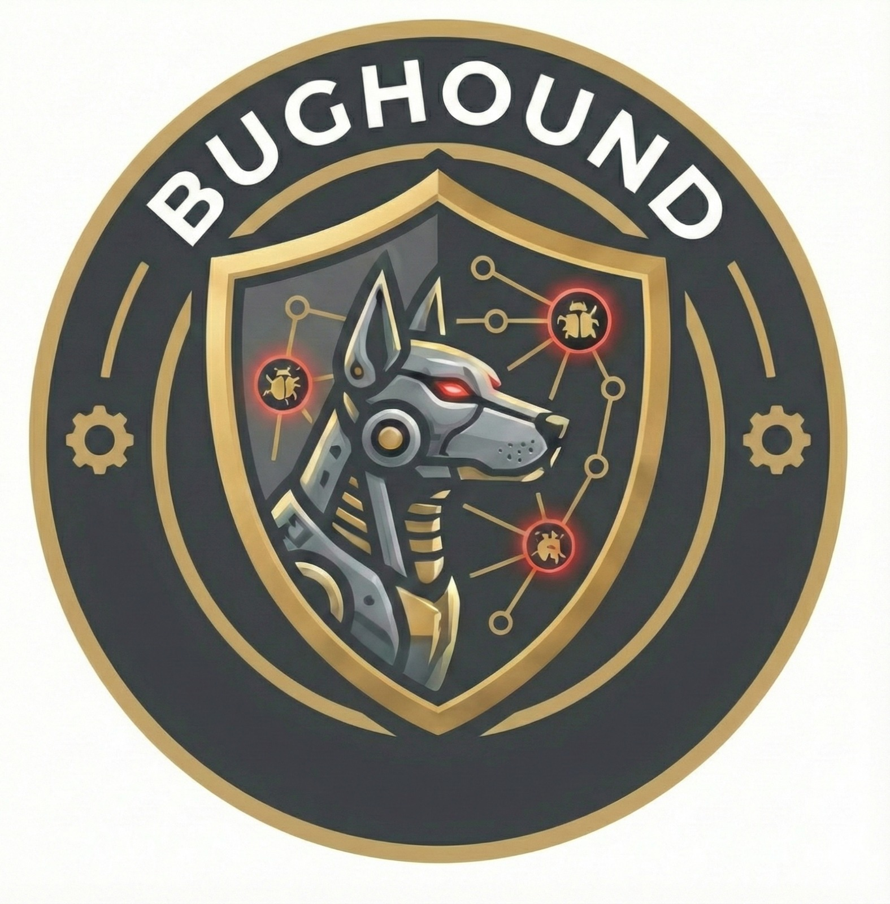

<p align="center">
  
</p>

<h1 align="center">BugHound MCP</h1>

<p align="center"><strong>MCP-Based Security Automation Framework</strong></p>

<p align="center">
  <code>Black Hat Arsenal Asia 2026</code> &nbsp;|&nbsp;
  <code>43 Techniques</code> &nbsp;|&nbsp;
  <code>35 Vuln Classes</code> &nbsp;|&nbsp;
  <code>3 Modes</code>
</p>

---

BugHound is a Model Context Protocol (MCP) server that provides a complete pipeline for web application security reconnaissance and vulnerability assessment. It exposes structured security tools as MCP endpoints, enabling AI clients (Claude, Gemini, Codex) to orchestrate a 7-stage pipeline from target input to verified vulnerability report. BugHound ships with 43 testing techniques -- 29 of which are pure-Python and require zero external tools -- covering injection, access control, server-side, configuration, and data leakage vulnerability classes.

## Features

- **7-Stage Pipeline** -- Init, Enumerate, Discover, Analyze, Test, Validate, Report -- stages collapse based on target type
- **43 Testing Techniques** -- pure-Python fallbacks for every category; no external tools required to start
- **3 Execution Modes** -- MCP Server (for AI clients), CLI (for terminal workflows), AI Agent (autonomous scanning)
- **Professional HTML Reports** -- dark teal dashboard with filtering, export, and executive summary
- **Auth-Aware Testing** -- JWT auto-propagation across all testing techniques
- **Live Reflection Probes** -- real-time XSS reflection detection during discovery
- **Attack Chain Detection** -- multi-step exploitation paths with composite scoring
- **Scope Enforcement** -- mandatory scope validation before any active testing
- **Adaptive Tool Coverage** -- gracefully adapts when external tools are unavailable

## Quick Start

```bash
git clone https://github.com/user/BugHound.git
cd BugHound
pip install -r requirements.txt
./scripts/install-tools.sh  # Optional: install Go/external tools

# Mode 1: MCP Server
python -m bughound.server

# Mode 2: CLI
./bhound scan https://target.com
./bhound scan https://target.com -v
./bhound recon https://target.com
./bhound list

# Mode 3: AI Agent
./bhound agent https://target.com --provider openrouter --api-key sk-or-...
```

## Installation

### Python Dependencies

```bash
pip install -r requirements.txt
```

Core dependencies: `mcp`, `pydantic`, `aiohttp`, `aiofiles`, `structlog`

Optional (for agent mode): `anthropic`, `openai`

### External Security Tools (Optional)

BugHound works with zero external tools using 29 pure-Python techniques. For full coverage (43 techniques), install the following:

| Tool | Purpose | Install |
|------|---------|---------|
| nuclei | Template-based scanning | `go install github.com/projectdiscovery/nuclei/v3/cmd/nuclei@latest` |
| httpx | HTTP probing | `go install github.com/projectdiscovery/httpx/cmd/httpx@latest` |
| katana | Web crawling | `go install github.com/projectdiscovery/katana/cmd/katana@latest` |
| subfinder | Subdomain discovery | `go install github.com/projectdiscovery/subfinder/v2/cmd/subfinder@latest` |
| gau | URL discovery | `go install github.com/lc/gau/v2/cmd/gau@latest` |
| waybackurls | Archive URLs | `go install github.com/tomnomnom/waybackurls@latest` |
| sqlmap | SQLi validation | `apt install sqlmap` or `pip install sqlmap` |
| dalfox | XSS validation | `go install github.com/hahwul/dalfox/v2@latest` |
| ffuf | Directory fuzzing | `go install github.com/ffuf/ffuf/v2@latest` |
| arjun | Parameter discovery | `pip install arjun` |
| wafw00f | WAF detection | `pip install wafw00f` |
| assetfinder | Subdomain discovery | `go install github.com/tomnomnom/assetfinder@latest` |
| findomain | Subdomain discovery | Download from [GitHub releases](https://github.com/Edu4rdSHL/findomain/releases) |
| gotator | Subdomain permutation | `go install github.com/Josue87/gotator@latest` |
| puredns | DNS resolution | `go install github.com/d3mondev/puredns/v2@latest` |

Run `./scripts/install-tools.sh` to install all Go tools automatically.

## MCP Configuration

### Claude Code

Create `.mcp.json` in your project root:

```json
{
  "mcpServers": {
    "bughound": {
      "type": "stdio",
      "command": "python3",
      "args": ["-m", "bughound.server"],
      "cwd": "/path/to/BugHound",
      "env": {
        "PYTHONPATH": "/path/to/BugHound",
        "BUGHOUND_WORKSPACE_DIR": "/path/to/workspaces"
      }
    }
  }
}
```

Or add via CLI: `claude mcp add --transport stdio --scope project bughound -- python3 -m bughound.server`

### Gemini CLI

Add to `~/.gemini/settings.json` or `.gemini/settings.json` in your project:

```json
{
  "mcpServers": {
    "bughound": {
      "command": "python3",
      "args": ["-m", "bughound.server"],
      "cwd": "/path/to/BugHound",
      "env": {
        "PYTHONPATH": "/path/to/BugHound",
        "BUGHOUND_WORKSPACE_DIR": "/path/to/workspaces"
      },
      "timeout": 600000
    }
  }
}
```

### OpenAI Codex

Add to `~/.codex/config.toml` or `.codex/config.toml` in your project:

```toml
[mcp_servers.bughound]
command = "python3"
args = ["-m", "bughound.server"]
cwd = "/path/to/BugHound"
startup_timeout_sec = 30
tool_timeout_sec = 300

[mcp_servers.bughound.env]
PYTHONPATH = "/path/to/BugHound"
BUGHOUND_WORKSPACE_DIR = "/path/to/workspaces"
```

## MCP Tools Reference

BugHound exposes 28 MCP tools organized by function:

| Tool | Description |
|------|-------------|
| `bughound_init` | Initialize workspace -- classify target, create workspace |
| `bughound_enumerate` | Stage 1: subdomain discovery (subfinder, assetfinder, crtsh, passive APIs) |
| `bughound_enumerate_deep` | Stage 1 deep: active enumeration + DNS bruteforce (background job) |
| `bughound_discover` | Stage 2: full discovery -- probe, crawl, JS analysis, dir scan, param classification |
| `bughound_get_attack_surface` | Stage 3: attack surface analysis with chains, immediate wins, reasoning prompts |
| `bughound_submit_scan_plan` | Submit testing strategy (targets + test classes) |
| `bughound_execute_tests` | Stage 4: run all techniques based on scan plan (background job) |
| `bughound_test_single` | Surgical test on one endpoint with one technique |
| `bughound_nuclei_scan` | Direct nuclei scan with custom options |
| `bughound_list_techniques` | List all 43 techniques with availability |
| `bughound_list_pipelines` | List 17 one-liner pipelines |
| `bughound_run_pipeline` | Run a one-liner pipeline (gf + qsreplace + kxss etc.) |
| `bughound_validate_all` | Stage 5: batch validate all findings (background job) |
| `bughound_validate_finding` | Validate one specific finding |
| `bughound_validate_immediate_wins` | Validate Stage 3 immediate wins |
| `bughound_generate_report` | Stage 6: generate HTML + markdown reports |
| `bughound_analyze_host` | Deep-dive analysis of a specific host |
| `bughound_enrich_target` | Intelligence dossier on a host |
| `bughound_get_immediate_wins` | Get findings ready to report without testing |
| `bughound_scope_check` | Verify target is in scope |
| `bughound_check_tool_coverage` | Check installed security tools |
| `bughound_workspace_list` | List all workspaces |
| `bughound_workspace_get` | Get workspace details |
| `bughound_workspace_results` | View workspace results dashboard |
| `bughound_workspace_delete` | Delete a workspace |
| `bughound_job_status` | Check background job progress |
| `bughound_job_results` | Get completed job results |
| `bughound_job_cancel` | Cancel a running job |

## Usage Prompts for AI Clients

When using BugHound through an AI client (Claude, Gemini, Codex), use natural language prompts:

**Basic scan:**
```
Scan https://target.com for vulnerabilities using BugHound
```

**Step by step:**
```
1. Initialize BugHound for https://target.com
2. Run discovery
3. Show me the attack surface
4. Create a scan plan focused on SQLi and XSS
5. Execute the tests
6. Validate the findings
7. Generate a report
```

**Quick recon:**
```
Run BugHound recon on example.com and show me what you find
```

**Targeted test:**
```
Test https://target.com/api/search?q=test for SQL injection using BugHound
```

## CLI Reference

```
./bhound scan <target>                    # Full pipeline (Stages 0-6)
./bhound scan <target> -v                 # Verbose mode
./bhound scan <target> --depth deep       # Deep scan
./bhound scan <target> --skip-validate    # Skip validation
./bhound scan <target> --resume <ws_id>   # Resume crashed scan
./bhound scan <target> --output json      # JSON output for CI/CD
./bhound recon <target>                   # Discovery only (Stages 0-2)
./bhound analyze <workspace_id>           # Attack surface analysis
./bhound test <workspace_id>              # Run tests on existing recon
./bhound validate <workspace_id>          # Validate findings
./bhound report <workspace_id>            # Generate reports
./bhound list                             # List workspaces
./bhound agent <target> --provider ...    # AI agent mode
./bhound serve                            # Start MCP server
```

## AI Agent Mode

BugHound includes an autonomous agent mode that uses an LLM to drive the entire scanning pipeline:

```bash
# Using OpenRouter (access to all models)
./bhound agent https://target.com --provider openrouter --model anthropic/claude-sonnet-4.5

# Using .env file for API key
echo "OPENROUTER_API_KEY=sk-or-..." > .env
./bhound agent https://target.com --provider openrouter

# Supported providers
--provider anthropic    # Claude (native SDK)
--provider openai       # GPT-4o
--provider grok         # Grok-3 (xAI)
--provider openrouter   # Any model via OpenRouter
```

## Pipeline Architecture

```
Stage 0: Init        -->  Target classification + workspace
Stage 1: Enumerate   -->  Subdomain discovery (skipped for single hosts)
Stage 2: Discover    -->  Probe, crawl, JS analysis, dir scan, param classification
Stage 3: Analyze     -->  Attack surface, chains, immediate wins, scan plan
Stage 4: Test        -->  43 techniques in parallel (nuclei + pure-Python)
Stage 5: Validate    -->  Surgical verification (sqlmap, dalfox, curl)
Stage 6: Report      -->  HTML dashboard, bug bounty MD, executive summary
```

Stages collapse based on target type:
- **Broad domain** (`*.example.com`): all stages run
- **Single host** (`dev.example.com`): Stage 1 skipped, Stage 2 starts at probing
- **Single endpoint** (`https://dev.example.com/api`): Stage 1 skipped, Stage 2 crawls from path only
- **URL list**: Stage 1 skipped, batch probe and crawl

## Techniques (43 Total)

**Injection**
- SQLi (error-based, blind, time-based), XSS (reflected, stored, DOM), SSTI, CSTI, CRLF, header injection

**File Access**
- LFI, XXE, path traversal

**Server-Side**
- SSRF, RCE (command injection, eval), prototype pollution

**Access Control**
- IDOR, path IDOR, broken access control, mass assignment

**Configuration**
- Security headers, version disclosure, transport security, ViewState MAC, default credentials

**Data Leaks**
- Sensitive field leakage, PII in HTML, vulnerable components

**Authentication**
- Cookie injection (SQLi, XSS, deserialization), JWT analysis, rate limiting

**External**
- Nuclei templates, WordPress, Spring actuator, GraphQL (introspection + data leaks), CORS

## Project Structure

```
BugHound/
├── CLAUDE.md                  # Project instructions
├── PLAN.md                    # Development plan
├── DEVLOG.md                  # Development journal
├── README.md
├── bughound/
│   ├── server.py              # MCP server entry point
│   ├── config/
│   │   └── settings.py        # Configuration
│   ├── core/
│   │   ├── target_classifier.py   # Stage 0: target type detection
│   │   ├── workspace.py           # Workspace CRUD + lazy dir creation
│   │   ├── job_manager.py         # Async job lifecycle
│   │   └── tool_runner.py         # Unified subprocess runner
│   ├── stages/
│   │   ├── enumerate.py       # Stage 1
│   │   ├── discover.py        # Stage 2
│   │   ├── analyze.py         # Stage 3
│   │   ├── test.py            # Stage 4
│   │   ├── validate.py        # Stage 5
│   │   └── report.py          # Stage 6
│   ├── tools/
│   │   ├── base.py            # Unified base tool
│   │   ├── recon/             # subfinder, httpx, crtsh, etc.
│   │   ├── scanning/          # nuclei, ffuf, dalfox, sqlmap, etc.
│   │   ├── discovery/         # gospider, jsluice, arjun, etc.
│   │   ├── testing/           # injection_tester, graphql, jwt testers
│   │   └── oneliners/         # qsreplace, kxss, gf, uro, unfurl, anew + pipeline engine
│   ├── schemas/
│   │   └── models.py          # Pydantic models
│   └── utils/
│       └── helpers.py
├── tests/
├── scripts/
│   └── install-tools.sh       # Security tools installer
└── workspaces/                # Runtime data (gitignored)
```

## Black Hat Arsenal

BugHound is featured at **Black Hat Arsenal Asia 2026**.

- **Date:** April 24, 2026
- **Track:** Web AppSec
- **Location:** Arsenal Station 2, Business Hall
- **Event:** [Black Hat Asia 2026](https://www.blackhat.com/asia-26/)

## License

MIT License

## Credits

Built by **Krishna Naidu**, **eric tee**, **Lwin Min Oo**, **Kai-Wei Hoon**, **Valen Sai**
