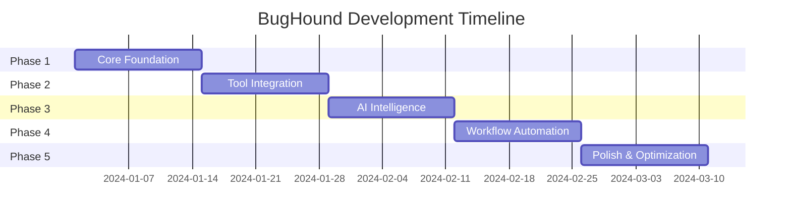
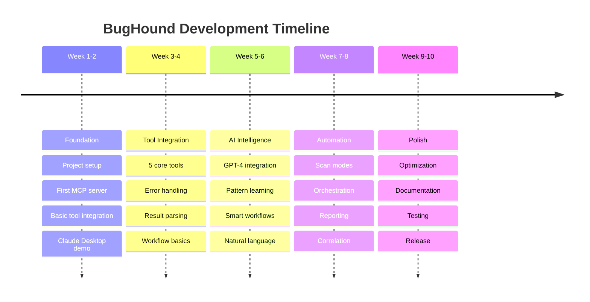

# BugHound - AI-Powered Bug Bounty MCP Agent
## Complete Development Plan & Architecture

---

## 📋 Table of Contents

1. [Executive Summary](#executive-summary)
2. [Project Vision & Goals](#project-vision--goals)
3. [Core Architecture](#core-architecture)
4. [Technology Stack](#technology-stack)
5. [Development Phases](#development-phases)
6. [Detailed Implementation Roadmap](#detailed-implementation-roadmap)
7. [Technical Specifications](#technical-specifications)
8. [AI Integration Strategy](#ai-integration-strategy)
9. [Tool Integration Plan](#tool-integration-plan)
10. [Testing & Quality Assurance](#testing--quality-assurance)
11. [Deployment Strategy](#deployment-strategy)
12. [Success Metrics](#success-metrics)
13. [Risk Management](#risk-management)
14. [Timeline & Milestones](#timeline--milestones)

---

## Executive Summary

**BugHound** is an AI-first security testing platform that revolutionizes bug bounty hunting by combining intelligent automation with conversational interfaces. Unlike traditional tools that simply execute commands, BugHound understands context, makes intelligent decisions, and provides actionable insights through natural language interactions.

### Key Differentiators
- **AI-Driven Intelligence**: Not just tool automation, but intelligent analysis and decision-making
- **Conversational Interface**: Natural language interaction via MCP with Claude, Gemini, and other AI assistants
- **Learning System**: Improves effectiveness over time by learning from scan results
- **Focused Simplicity**: 5-7 core tools implemented perfectly rather than 50+ tools poorly integrated
- **Actionable Insights**: Delivers prioritized, contextualized findings instead of raw data dumps

### Target Users
- Bug bounty hunters seeking efficiency
- Security professionals wanting intelligent automation
- Developers needing security assessment capabilities
- Organizations requiring automated security testing

---

## Project Vision & Goals

### Vision Statement
> "Transform security testing from command-line complexity to conversational simplicity, where AI understands intent and delivers intelligence, not just data."

### Primary Goals

1. **Intelligent Automation**
   - Automate the tedious parts of bug bounty hunting
   - Make smart decisions about what to scan and when
   - Reduce false positives through AI analysis

2. **Conversational Security**
   - Enable natural language security testing
   - Provide contextual recommendations
   - Explain findings in understandable terms

3. **Continuous Learning**
   - Learn from every scan to improve future results
   - Build pattern recognition for vulnerability detection
   - Adapt workflows based on success rates

4. **Tool Excellence**
   - Perfect integration of essential tools
   - Reliable execution with intelligent fallbacks
   - Clean, maintainable codebase

### Success Criteria
- Setup time < 15 minutes
- First meaningful finding < 5 minutes
- 80% reduction in false positives
- 10x faster than manual testing
- 95% user satisfaction rate

---

## Core Architecture

### System Overview

```
┌─────────────────────────────────────────────────────────────┐
│                    AI Applications Layer                     │
│        (Claude Desktop, Gemini CLI, Cursor, Trae)          │
└─────────────────────────────────────────────────────────────┘
                            │
                    MCP Protocol
                            │
┌─────────────────────────────────────────────────────────────┐
│                    BugHound MCP Servers                      │
├─────────────────┬─────────────────┬────────────────────────┤
│   Recon Server  │   Scan Server   │   Analyze Server       │
│                 │                  │                         │
│ • Subdomain     │ • Vuln Scanning │ • AI Analysis         │
│ • Asset Enum    │ • Web Testing   │ • Pattern Match       │
│ • Tech Detect   │ • Service Scan  │ • Risk Assessment     │
└─────────────────┴─────────────────┴────────────────────────┘
                            │
┌─────────────────────────────────────────────────────────────┐
│                      Core Engine                             │
├─────────────────┬─────────────────┬────────────────────────┤
│   AI Engine     │ Workflow Engine │   Pattern Engine       │
│                 │                  │                         │
│ • GPT Analysis  │ • Orchestration │ • GF Patterns         │
│ • Learning      │ • Tool Chaining │ • Custom Rules        │
│ • Decisions     │ • Parallelism   │ • Detection           │
└─────────────────┴─────────────────┴────────────────────────┘
                            │
┌─────────────────────────────────────────────────────────────┐
│                    Tool Wrappers                             │
├──────┬──────┬──────┬──────┬──────┬──────┬─────────────────┤
│ Sub  │ Httpx│ Nucl │ Nmap │ GF   │ Way  │ Future Tools    │
│finder│      │ ei   │      │      │ back │                 │
└──────┴──────┴──────┴──────┴──────┴──────┴─────────────────┘
                            │
┌─────────────────────────────────────────────────────────────┐
│                 Workspace & Storage                          │
├─────────────────────────────────────────────────────────────┤
│  Organized file system + SQLite DB + Result caching         │
└─────────────────────────────────────────────────────────────┘
```

### Component Details

#### 1. MCP Servers Layer
```python
# Three focused MCP servers, each with specific responsibilities

mcp_servers/
├── recon_server.py      # Asset discovery and enumeration
├── scan_server.py       # Vulnerability scanning and testing  
├── analyze_server.py    # AI-powered analysis and intelligence
└── common/
    ├── base_server.py   # Shared MCP server functionality
    └── protocols.py     # Common protocols and interfaces
```

#### 2. Core Engine
```python
core/
├── ai_engine.py         # AI integration and decision making
│   ├── analyze_findings()
│   ├── suggest_next_steps()
│   ├── learn_from_results()
│   └── generate_insights()
│
├── workflow_engine.py   # Scan orchestration
│   ├── execute_workflow()
│   ├── manage_dependencies()
│   ├── handle_parallelism()
│   └── track_progress()
│
└── pattern_engine.py    # Pattern matching and detection
    ├── apply_gf_patterns()
    ├── custom_detection()
    ├── extract_indicators()
    └── correlate_findings()
```

#### 3. Tool Integration Layer
```python
tools/
├── base_tool.py         # Abstract base class for all tools
├── recon/
│   ├── subfinder.py     # Subdomain enumeration
│   ├── httpx.py         # HTTP probing and analysis
│   └── waybackurls.py   # Historical URL discovery
├── scanning/
│   ├── nuclei.py        # Template-based scanning
│   └── nmap.py          # Port and service scanning
└── analysis/
    └── gf_patterns.py   # Pattern matching with gf
```

#### 4. Workspace Management
```
workspaces/
└── {target}_{timestamp}/
    ├── config.yaml      # Scan configuration
    ├── metadata.json    # Scan metadata and progress
    ├── subdomains/      # Discovered subdomains
    ├── urls/            # Discovered URLs
    ├── ports/           # Port scan results
    ├── vulnerabilities/ # Found vulnerabilities
    ├── patterns/        # Pattern matches
    ├── ai_analysis/     # AI insights and recommendations
    └── reports/         # Generated reports
```

---

## Technology Stack

### Core Technologies
- **Language**: Python 3.11+
- **MCP Framework**: Official MCP Python SDK
- **AI Integration**: OpenAI GPT-4, Claude API
- **Database**: SQLite for metadata, file system for results
- **Async Framework**: asyncio for concurrent operations

### Security Tools
- **Reconnaissance**: subfinder, httpx, waybackurls
- **Scanning**: nuclei, nmap
- **Analysis**: gf, custom patterns

### Development Tools
- **IDE**: Trae AI, VS Code with Python extensions
- **Version Control**: Git with conventional commits
- **Testing**: pytest, pytest-asyncio
- **CI/CD**: GitHub Actions
- **Documentation**: Sphinx, Markdown

### AI Platforms
- **Primary**: Claude Desktop (via MCP)
- **Secondary**: Gemini CLI, Cursor, Continue.dev
- **APIs**: OpenAI GPT-4, Anthropic Claude

---

## Development Phases

### Phase Overview



### Phase 1: Core Foundation (Weeks 1-2)
**Goal**: Build the foundational architecture and prove the concept

**Deliverables**:
- [ ] Project structure and configuration
- [ ] Basic MCP server implementation
- [ ] Core engine skeleton
- [ ] Simple tool wrapper for subfinder
- [ ] Basic workspace management
- [ ] Hello World with Claude Desktop

### Phase 2: Tool Integration (Weeks 3-4)
**Goal**: Integrate essential security tools with proper error handling

**Deliverables**:
- [ ] Complete tool wrapper framework
- [ ] Integrate 5 core tools
- [ ] Implement fallback mechanisms
- [ ] Add result parsing and normalization
- [ ] Create tool configuration system
- [ ] End-to-end reconnaissance workflow

### Phase 3: AI Intelligence (Weeks 5-6)
**Goal**: Add AI-powered analysis and decision making

**Deliverables**:
- [ ] GPT-4 integration for analysis
- [ ] Pattern learning system
- [ ] Intelligent workflow adaptation
- [ ] Context-aware recommendations
- [ ] False positive reduction
- [ ] Natural language insights

### Phase 4: Workflow Automation (Weeks 7-8)
**Goal**: Implement sophisticated scan workflows and orchestration

**Deliverables**:
- [ ] Scan mode implementation (quick, deep, stealth)
- [ ] Dependency management between tools
- [ ] Parallel execution optimization
- [ ] Progress tracking and reporting
- [ ] Comprehensive result correlation
- [ ] Automated report generation

### Phase 5: Polish & Optimization (Weeks 9-10)
**Goal**: Production readiness and performance optimization

**Deliverables**:
- [ ] Performance optimization
- [ ] Comprehensive error handling
- [ ] Security hardening
- [ ] Documentation completion
- [ ] Integration testing
- [ ] Public release preparation

---

## Detailed Implementation Roadmap

### Week 1-2: Foundation Sprint

#### Day 1-3: Project Setup
```python
# Tasks:
1. Initialize Git repository
2. Create project structure
3. Set up Python environment
4. Install MCP SDK
5. Create basic configuration system
6. Implement logging framework

# Deliverable: Working project skeleton
```

#### Day 4-7: First MCP Server
```python
# Create recon_server.py with:
- Basic MCP server structure
- Tool registration system  
- Simple subfinder integration
- Error handling
- Response formatting

# Test: Execute via Claude Desktop
```

#### Day 8-10: Core Engine Basics
```python
# Implement:
- workflow_engine.py with basic execution
- Simple workspace manager
- Result storage system
- Basic AI engine skeleton

# Test: End-to-end subdomain scan
```

#### Day 11-14: Integration & Testing
```python
# Complete:
- Claude Desktop configuration
- Basic integration tests
- Documentation setup
- First working demo

# Milestone: Working subdomain enumeration via Claude
```

### Week 3-4: Tool Integration Sprint

#### Day 15-18: Tool Framework
```python
class BaseTool(ABC):
    """Abstract base class for all security tools"""
    
    @abstractmethod
    async def execute(self, target: str, options: Dict) -> ToolResult:
        pass
    
    @abstractmethod
    def parse_output(self, raw_output: str) -> Dict:
        pass
    
    @abstractmethod
    def validate_installation(self) -> bool:
        pass
```

#### Day 19-21: Core Tool Integration
- Implement httpx wrapper
- Implement nuclei wrapper
- Implement waybackurls wrapper
- Add nmap wrapper

#### Day 22-24: Tool Orchestration
- Build tool chaining logic
- Implement parallel execution
- Add dependency resolution
- Create fallback system

#### Day 25-28: Testing & Refinement
- Integration testing for all tools
- Performance optimization
- Error handling improvements
- Real-world testing

### Week 5-6: AI Intelligence Sprint

#### Day 29-32: AI Engine Core
```python
class AIEngine:
    async def analyze_findings(self, findings: List[Finding]) -> Analysis:
        """Analyze security findings using GPT-4"""
        
    async def suggest_next_steps(self, context: ScanContext) -> List[Step]:
        """Suggest next steps based on current findings"""
        
    async def reduce_false_positives(self, findings: List[Finding]) -> List[Finding]:
        """Use AI to identify likely false positives"""
```

#### Day 33-35: Pattern Learning
- Implement pattern extraction
- Build learning database
- Create pattern matching engine
- Integrate gf patterns

#### Day 36-38: Intelligent Workflows
- Add workflow adaptation
- Implement smart tool selection
- Create context awareness
- Build recommendation system

#### Day 39-42: Natural Language Processing
- Implement conversational responses
- Add explanation generation
- Create insight summaries
- Build priority explanations

### Week 7-8: Workflow Automation Sprint

#### Day 43-46: Scan Modes
```yaml
scan_modes:
  quick:
    description: "Fast scan for quick assessment"
    tools: ["subfinder", "httpx"]
    timeout: 300
    
  comprehensive:
    description: "Deep scan with all tools"
    tools: ["subfinder", "httpx", "nmap", "nuclei", "waybackurls"]
    timeout: 3600
    
  stealth:
    description: "Low-profile scanning"
    tools: ["subfinder", "httpx"]
    options:
      rate_limit: 10
      user_agent: "random"
```

#### Day 47-49: Advanced Orchestration
- Implement dependency graphs
- Add conditional execution
- Create dynamic workflows
- Build progress tracking

#### Day 50-52: Result Processing
- Advanced correlation system
- Multi-tool result merging
- Duplicate detection
- Priority calculation

#### Day 53-56: Reporting System
- HTML report generation
- Markdown export
- JSON API output
- Executive summaries

### Week 9-10: Polish Sprint

#### Day 57-60: Performance
- Profile and optimize code
- Implement caching
- Add connection pooling
- Optimize AI calls

#### Day 61-63: Security
- Input validation
- Secure credential storage
- Rate limiting
- Audit logging

#### Day 64-66: Documentation
- User guide
- API documentation
- Integration guides
- Video tutorials

#### Day 67-70: Release Preparation
- Final testing
- Package preparation
- Release notes
- Community setup

---

## Technical Specifications

### API Design

#### MCP Tool Definitions
```python
tools = [
    {
        "name": "scan_target",
        "description": "Perform intelligent security scan of a target",
        "inputSchema": {
            "type": "object",
            "properties": {
                "target": {
                    "type": "string",
                    "description": "Domain or IP to scan"
                },
                "mode": {
                    "type": "string",
                    "enum": ["quick", "comprehensive", "stealth"],
                    "default": "quick"
                },
                "options": {
                    "type": "object",
                    "properties": {
                        "include_subdomains": {"type": "boolean", "default": True},
                        "port_scan": {"type": "boolean", "default": False},
                        "vulnerability_scan": {"type": "boolean", "default": True}
                    }
                }
            },
            "required": ["target"]
        }
    },
    {
        "name": "analyze_vulnerability",
        "description": "Get AI analysis of a specific vulnerability",
        "inputSchema": {
            "type": "object",
            "properties": {
                "vulnerability": {
                    "type": "object",
                    "description": "Vulnerability details"
                },
                "context": {
                    "type": "object",
                    "description": "Target context"
                }
            },
            "required": ["vulnerability"]
        }
    }
]
```

### Data Models

```python
@dataclass
class ScanResult:
    target: str
    scan_id: str
    timestamp: datetime
    mode: str
    findings: List[Finding]
    ai_analysis: AIAnalysis
    recommendations: List[Recommendation]
    risk_score: float
    
@dataclass
class Finding:
    type: str  # subdomain, vulnerability, exposure, etc.
    severity: str  # critical, high, medium, low, info
    confidence: float  # 0.0 to 1.0
    evidence: Dict[str, Any]
    tool_source: str
    verified: bool
    
@dataclass
class AIAnalysis:
    summary: str
    key_risks: List[str]
    attack_vectors: List[str]
    business_impact: str
    false_positive_assessment: Dict[str, float]
    
@dataclass
class Recommendation:
    priority: int
    action: str
    reasoning: str
    effort: str  # low, medium, high
    impact: str  # low, medium, high
```

### Configuration Schema

```yaml
# config.yaml
bughound:
  version: "1.0.0"
  
  # AI Configuration
  ai:
    provider: "openai"  # openai, anthropic, local
    model: "gpt-4"
    temperature: 0.7
    max_tokens: 2000
    
  # Tool Configuration  
  tools:
    subfinder:
      enabled: true
      timeout: 300
      options:
        threads: 10
        
    httpx:
      enabled: true
      timeout: 30
      options:
        threads: 50
        follow_redirects: true
        
    nuclei:
      enabled: true
      timeout: 1800
      options:
        templates: "critical,high,medium"
        rate_limit: 150
        
  # Workflow Configuration
  workflows:
    default_mode: "quick"
    max_parallel_tools: 3
    progress_update_interval: 5
    
  # Storage Configuration
  storage:
    workspace_dir: "./workspaces"
    retention_days: 30
    compress_old_results: true
    
  # Security Configuration
  security:
    rate_limiting:
      enabled: true
      requests_per_minute: 60
    credential_encryption: true
    audit_logging: true
```

---

## AI Integration Strategy

### 1. Analysis Pipeline

```python
class AIAnalysisPipeline:
    def __init__(self):
        self.gpt_client = OpenAI()
        self.context_builder = ContextBuilder()
        self.prompt_templates = PromptTemplates()
        
    async def analyze_scan_results(self, results: ScanResult) -> AIAnalysis:
        # Build context from scan results
        context = self.context_builder.build(results)
        
        # Generate analysis prompt
        prompt = self.prompt_templates.analysis_prompt(context)
        
        # Get AI analysis
        response = await self.gpt_client.complete(prompt)
        
        # Parse and structure response
        return self.parse_ai_response(response)
```

### 2. Conversational Interface

```python
class ConversationalInterface:
    async def handle_user_query(self, query: str, context: Dict) -> str:
        # Understand intent
        intent = await self.understand_intent(query)
        
        # Execute appropriate action
        if intent.type == "scan":
            result = await self.execute_scan(intent.target, intent.options)
            return self.format_scan_response(result)
            
        elif intent.type == "explain":
            explanation = await self.explain_finding(intent.finding)
            return self.format_explanation(explanation)
            
        elif intent.type == "recommend":
            recommendations = await self.get_recommendations(context)
            return self.format_recommendations(recommendations)
```

### 3. Learning System

```python
class LearningSystem:
    def __init__(self):
        self.pattern_db = PatternDatabase()
        self.success_tracker = SuccessTracker()
        
    async def learn_from_scan(self, scan_result: ScanResult):
        # Extract patterns from successful findings
        patterns = await self.extract_patterns(scan_result.findings)
        
        # Update pattern database
        await self.pattern_db.add_patterns(patterns)
        
        # Track tool effectiveness
        await self.success_tracker.update_tool_stats(scan_result)
        
        # Improve workflow recommendations
        await self.update_workflow_preferences(scan_result)
```

---

## Tool Integration Plan

### Core Tool Set

#### 1. Subfinder
```python
class SubfinderTool(BaseTool):
    """Passive subdomain enumeration"""
    
    async def execute(self, target: str, options: Dict) -> ToolResult:
        cmd = ["subfinder", "-d", target, "-json"]
        if options.get("timeout"):
            cmd.extend(["-timeout", str(options["timeout"])])
            
        result = await self.run_command(cmd)
        return self.parse_output(result)
```

#### 2. Httpx
```python
class HttpxTool(BaseTool):
    """HTTP probing and analysis"""
    
    async def execute(self, targets: List[str], options: Dict) -> ToolResult:
        cmd = ["httpx", "-l", "-", "-json", "-tech-detect", "-title"]
        if options.get("follow_redirects"):
            cmd.append("-follow-redirects")
            
        result = await self.run_command_with_input(cmd, "\n".join(targets))
        return self.parse_output(result)
```

#### 3. Nuclei
```python
class NucleiTool(BaseTool):
    """Template-based vulnerability scanning"""
    
    async def execute(self, targets: List[str], options: Dict) -> ToolResult:
        cmd = ["nuclei", "-l", "-", "-json"]
        
        # Add severity filters
        if options.get("severity"):
            cmd.extend(["-severity", options["severity"]])
            
        # Add rate limiting
        if options.get("rate_limit"):
            cmd.extend(["-rate-limit", str(options["rate_limit"])])
            
        result = await self.run_command_with_input(cmd, "\n".join(targets))
        return self.parse_output(result)
```

### Tool Execution Framework

```python
class ToolExecutor:
    def __init__(self):
        self.tools = self.load_tools()
        self.fallback_map = self.load_fallbacks()
        
    async def execute_tool(self, tool_name: str, target: str, options: Dict) -> ToolResult:
        tool = self.tools.get(tool_name)
        
        if not tool:
            raise ToolNotFoundError(f"Tool {tool_name} not found")
            
        try:
            # Check if tool is installed
            if not tool.validate_installation():
                await self.install_tool(tool_name)
                
            # Execute with timeout
            result = await asyncio.wait_for(
                tool.execute(target, options),
                timeout=options.get("timeout", 300)
            )
            
            return result
            
        except Exception as e:
            # Try fallback tool
            fallback = self.fallback_map.get(tool_name)
            if fallback:
                return await self.execute_tool(fallback, target, options)
            raise
```

---

## Testing & Quality Assurance

### Testing Strategy

#### 1. Unit Testing
```python
# tests/test_tools.py
@pytest.mark.asyncio
async def test_subfinder_execution():
    tool = SubfinderTool()
    result = await tool.execute("example.com", {})
    
    assert result.success
    assert len(result.data["subdomains"]) > 0
    assert "example.com" in result.data["subdomains"]
```

#### 2. Integration Testing
```python
# tests/test_workflows.py
@pytest.mark.asyncio
async def test_reconnaissance_workflow():
    workflow = ReconnaissanceWorkflow()
    result = await workflow.execute("example.com")
    
    assert result.subdomains_found > 0
    assert result.live_hosts > 0
    assert result.technologies_identified > 0
```

#### 3. AI Testing
```python
# tests/test_ai_analysis.py
@pytest.mark.asyncio
async def test_vulnerability_analysis():
    ai_engine = AIEngine()
    vuln = Finding(
        type="SQL Injection",
        severity="high",
        evidence={"parameter": "id", "payload": "1' OR '1'='1"}
    )
    
    analysis = await ai_engine.analyze_finding(vuln)
    
    assert analysis.severity_assessment in ["high", "critical"]
    assert len(analysis.exploitation_steps) > 0
    assert analysis.remediation_advice != ""
```

### Quality Metrics

- **Code Coverage**: Minimum 80%
- **Response Time**: 95% of operations < 5s
- **Error Rate**: < 1% for normal operations
- **AI Accuracy**: > 85% for vulnerability classification
- **Tool Reliability**: > 95% success rate

---

## Deployment Strategy

### Local Development
```bash
# Clone repository
git clone https://github.com/yourusername/bughound.git
cd bughound

# Create virtual environment
python -m venv venv
source venv/bin/activate

# Install dependencies
pip install -r requirements.txt

# Install security tools
./scripts/install_tools.sh

# Configure
cp config.example.yaml config.yaml
# Edit config.yaml with your settings

# Run tests
pytest

# Start MCP server
python -m bughound.mcp_servers.recon_server
```

### Production Deployment

#### Docker Deployment
```dockerfile
FROM python:3.11-slim

# Install system dependencies
RUN apt-get update && apt-get install -y \
    git curl wget nmap \
    && rm -rf /var/lib/apt/lists/*

# Install Go for tools
RUN wget https://go.dev/dl/go1.21.linux-arm64.tar.gz
RUN tar -C /usr/local -xzf go1.21.linux-arm64.tar.gz
ENV PATH=$PATH:/usr/local/go/bin

# Install security tools
RUN go install github.com/projectdiscovery/subfinder/v2/cmd/subfinder@latest
RUN go install github.com/projectdiscovery/httpx/cmd/httpx@latest
RUN go install github.com/projectdiscovery/nuclei/v2/cmd/nuclei@latest

# Copy application
WORKDIR /app
COPY . .
RUN pip install -r requirements.txt

# Run
CMD ["python", "-m", "bughound.mcp_servers.main"]
```

#### Cloud Deployment
- **AWS**: ECS with Fargate for serverless execution
- **GCP**: Cloud Run for auto-scaling
- **Azure**: Container Instances for simple deployment

---

## Success Metrics

### Technical Metrics
1. **Performance**
   - Scan completion time < 5 minutes for average target
   - Tool execution success rate > 95%
   - AI response time < 2 seconds

2. **Accuracy**
   - False positive rate < 20%
   - Vulnerability detection rate > 80%
   - AI recommendation relevance > 85%

3. **Reliability**
   - Uptime > 99.5%
   - Error recovery rate > 90%
   - Data consistency 100%

### User Metrics
1. **Adoption**
   - 100 active users within 3 months
   - 1000 scans per month
   - 5+ integrations with AI platforms

2. **Satisfaction**
   - User satisfaction score > 4.5/5
   - Feature request implementation rate > 50%
   - Bug fix time < 48 hours

3. **Impact**
   - Average time to first finding < 5 minutes
   - 10x productivity improvement reported
   - 50% reduction in manual work

---

## Risk Management

### Technical Risks

| Risk | Impact | Probability | Mitigation |
|------|--------|-------------|------------|
| Tool dependency failures | High | Medium | Implement robust fallback system |
| AI API rate limits | Medium | High | Cache responses, use multiple providers |
| Performance issues | Medium | Medium | Optimize code, implement caching |
| Security tool detection | Low | Medium | Implement stealth modes |

### Project Risks

| Risk | Impact | Probability | Mitigation |
|------|--------|-------------|------------|
| Scope creep | High | High | Strict phase boundaries, focused goals |
| Complexity explosion | High | Medium | Keep it simple, resist feature creep |
| Integration difficulties | Medium | Medium | Early testing with AI platforms |
| User adoption | Medium | Low | Focus on user experience |

### Mitigation Strategies

1. **Technical**
   - Comprehensive error handling
   - Graceful degradation
   - Regular testing and monitoring
   - Performance profiling

2. **Project**
   - Weekly reviews and adjustments
   - Clear milestone definitions
   - Regular user feedback
   - Agile development approach

---

## Timeline & Milestones

### Project Timeline



### Key Milestones

| Week | Milestone | Success Criteria |
|------|-----------|------------------|
| 2 | First Demo | Working subdomain scan via Claude |
| 4 | Tool Integration | 5 tools working end-to-end |
| 6 | AI Intelligence | Smart recommendations working |
| 8 | Full Automation | Complete workflows implemented |
| 10 | Public Release | Production-ready release |

### Sprint Schedule

**Week 1-2: Foundation Sprint**
- Daily standups at 9 AM
- Code review every 2 days
- Demo on Friday

**Week 3-4: Integration Sprint**
- Tool integration focus
- Daily testing sessions
- Performance monitoring

**Week 5-6: Intelligence Sprint**
- AI feature development
- User testing sessions
- Feedback incorporation

**Week 7-8: Automation Sprint**
- Workflow implementation
- Integration testing
- Documentation writing

**Week 9-10: Polish Sprint**
- Bug fixes and optimization
- Final testing
- Release preparation

---

## Appendices

### A. Tool Installation Script
```bash
#!/bin/bash
# scripts/install_tools.sh

echo "Installing BugHound security tools..."

# Update system
sudo apt update

# Install Go (required for many tools)
if ! command -v go &> /dev/null; then
    wget https://go.dev/dl/go1.21.0.linux-amd64.tar.gz
    sudo tar -C /usr/local -xzf go1.21.0.linux-amd64.tar.gz
    echo 'export PATH=$PATH:/usr/local/go/bin' >> ~/.bashrc
    source ~/.bashrc
fi

# Install Python tools
pip install -r requirements.txt

# Install reconnaissance tools
echo "Installing reconnaissance tools..."
go install -v github.com/projectdiscovery/subfinder/v2/cmd/subfinder@latest
go install -v github.com/projectdiscovery/httpx/cmd/httpx@latest
go install github.com/tomnomnom/waybackurls@latest

# Install scanning tools
echo "Installing scanning tools..."
go install -v github.com/projectdiscovery/nuclei/v2/cmd/nuclei@latest
nuclei -update-templates
sudo apt install -y nmap

# Install pattern matching tools
echo "Installing pattern matching tools..."
go install github.com/tomnomnom/gf@latest
# Clone gf patterns
git clone https://github.com/1ndianl33t/Gf-Patterns ~/.gf

echo "Tool installation complete!"
```

### B. Quick Start Guide

```markdown
# BugHound Quick Start Guide

## Installation (5 minutes)

1. Clone the repository:
   ```bash
   git clone https://github.com/yourusername/bughound.git
   cd bughound
   ```

2. Run setup script:
   ```bash
   ./scripts/setup.sh
   ```

3. Configure API keys:
   ```bash
   cp config.example.yaml config.yaml
   # Edit config.yaml and add your OpenAI API key
   ```

## First Scan (2 minutes)

1. Configure Claude Desktop:
   - Copy `claude_desktop_config.json` to Claude's config directory
   - Restart Claude Desktop

2. Start a conversation:
   ```
   You: Scan example.com for security issues
   
   BugHound: I'll scan example.com for you. Starting with reconnaissance...
   
   Found 15 subdomains:
   - api.example.com (REST API)
   - admin.example.com (Admin panel)
   - staging.example.com (Development server)
   ...
   
   Would you like me to:
   1. Deep scan the API for vulnerabilities?
   2. Check the admin panel for common issues?
   3. Test the staging server?
   ```

## Common Commands

- **Quick scan**: "Check [target] quickly"
- **Deep scan**: "Perform comprehensive security scan of [target]"
- **Specific test**: "Check [target] for SQL injection"
- **Analysis**: "Explain this vulnerability: [details]"
- **Recommendations**: "What should I do next?"
```

### C. Example Conversations

```markdown
# Example Conversations with BugHound

## Example 1: Basic Reconnaissance

User: "I want to test hackerone.com for their bug bounty program"

BugHound: "I'll help you scan hackerone.com. Since this is for their bug bounty program, I'll use their defined scope. Starting reconnaissance...

✅ Subdomain Discovery:
Found 42 subdomains for hackerone.com:
- api.hackerone.com (GraphQL API)
- www.hackerone.com (Main site)
- docs.hackerone.com (Documentation)
- gslink.hackerone.com (Appears to be internal)

🌐 Live Services (23 active):
- api.hackerone.com - GraphQL endpoint with introspection disabled
- www.hackerone.com - React application, Cloudflare protected
- docs.hackerone.com - GitBook documentation portal

🎯 Interesting findings:
1. The API endpoint has rate limiting (60 req/min)
2. Main site uses Content Security Policy
3. Several subdomains appear to be out of scope

Would you like me to:
1. Test the API endpoints for common GraphQL vulnerabilities?
2. Analyze the CSP implementation for bypasses?
3. Focus on in-scope assets only?"

## Example 2: Vulnerability Analysis

User: "I found an endpoint at https://api.example.com/v1/users/search?q=test that might be vulnerable. Can you check it?"

BugHound: "I'll analyze that endpoint for potential vulnerabilities.

🔍 Testing https://api.example.com/v1/users/search?q=test

Performed tests:
- SQL Injection (5 payloads)
- NoSQL Injection (3 payloads)  
- LDAP Injection (3 payloads)
- Command Injection (4 payloads)
- XSS (reflected) (5 payloads)

⚠️ Potential SQL Injection Detected!

Evidence:
- Payload: `test' OR '1'='1`
- Response time increased from 200ms to 2.3s
- Error message leaked: "MySQL error: syntax error near ''''"
- Database appears to be MySQL 5.7

Risk Assessment:
- Severity: High (CVSS 7.5)
- Confidence: 85%
- Impact: Potential data breach, authentication bypass

Next steps:
1. Would you like me to identify the exact injection point?
2. Should I test for data extraction possibilities?
3. Want me to generate a proof-of-concept?"

## Example 3: Smart Recommendations

User: "I've been scanning for an hour and found lots of things. What should I focus on?"

BugHound: "Let me analyze your findings and prioritize them for maximum impact.

📊 Scan Summary:
- Total findings: 47
- Critical: 1
- High: 4  
- Medium: 12
- Low: 30

🎯 Top Priorities (Focus on these first):

1. **SQL Injection in Login Form** (CRITICAL)
   - Location: https://app.example.com/login
   - Impact: Full database access
   - Effort: 30 minutes to create PoC
   - Potential bounty: $1000-3000

2. **Exposed GraphQL Introspection** (HIGH)
   - Location: https://api.example.com/graphql
   - Impact: API schema disclosure
   - Effort: 10 minutes to document
   - Potential bounty: $500-1000

3. **Stored XSS in Comments** (HIGH)
   - Location: Profile comments section
   - Impact: Account takeover possible
   - Effort: 20 minutes for PoC
   - Potential bounty: $750-1500

💡 Strategic Advice:
- The SQL injection is your highest value finding
- Chain the GraphQL exposure with other findings
- The XSS could be escalated if you find admin accounts

Skip these (likely duplicates or false positives):
- Missing security headers (30 findings) - usually not accepted
- Version disclosure - low impact unless outdated

Would you like me to help create the proof-of-concept for the SQL injection?"
```

### D. Configuration Examples

```yaml
# config.yaml - Full Configuration Example

bughound:
  # Basic settings
  version: "1.0.0"
  debug: false
  
  # AI Configuration
  ai:
    # Primary AI provider
    primary_provider: "openai"
    fallback_provider: "anthropic"
    
    # OpenAI settings
    openai:
      api_key: "${OPENAI_API_KEY}"
      model: "gpt-4"
      temperature: 0.7
      max_tokens: 2000
      
    # Anthropic settings  
    anthropic:
      api_key: "${ANTHROPIC_API_KEY}"
      model: "claude-3-opus-20240229"
      
    # AI behavior settings
    analysis:
      explain_findings: true
      suggest_next_steps: true
      reduce_false_positives: true
      confidence_threshold: 0.7
      
  # Tool Configuration
  tools:
    # Reconnaissance tools
    subfinder:
      enabled: true
      timeout: 300
      options:
        threads: 10
        recursive: true
        
    httpx:
      enabled: true
      timeout: 30
      options:
        threads: 50
        follow_redirects: true
        tech_detect: true
        status_code: true
        
    waybackurls:
      enabled: true
      timeout: 180
      options:
        dates: "2020-2024"
        
    # Scanning tools
    nuclei:
      enabled: true
      timeout: 1800
      options:
        severity: "critical,high,medium"
        templates: "cves,exposures,misconfiguration"
        rate_limit: 150
        bulk_size: 25
        
    nmap:
      enabled: true
      timeout: 600
      options:
        scan_type: "aggressive"
        top_ports: 1000
        
    # Pattern matching
    gf:
      enabled: true
      patterns:
        - "aws-keys"
        - "base64"
        - "cors"
        - "debug-pages"
        - "firebase"
        - "fw"
        - "go-functions"
        - "http-auth"
        - "ip"
        - "json-sec"
        - "meg-headers"
        - "php-errors"
        - "php-serialized"
        - "php-sinks"
        - "php-sources"
        - "s3-buckets"
        - "sec"
        - "servers"
        - "strings"
        - "takeovers"
        - "urls"
        
  # Workflow Configuration
  workflows:
    # Default scan mode
    default_mode: "balanced"
    
    # Scan modes
    modes:
      quick:
        description: "Fast 5-minute scan"
        tools: ["subfinder", "httpx"]
        parallel: true
        timeout: 300
        
      balanced:
        description: "Standard 15-minute scan"
        tools: ["subfinder", "httpx", "waybackurls", "nuclei"]
        parallel: true
        timeout: 900
        
      deep:
        description: "Comprehensive 60-minute scan"
        tools: ["subfinder", "httpx", "waybackurls", "nmap", "nuclei", "gf"]
        parallel: false
        timeout: 3600
        
      stealth:
        description: "Low-profile scan"
        tools: ["subfinder", "httpx"]
        parallel: false
        timeout: 1800
        options:
          rate_limit: 10
          random_delay: "1-5"
          
    # Execution settings
    execution:
      max_parallel_tools: 3
      max_parallel_targets: 5
      progress_update_interval: 5
      auto_retry_failed: true
      retry_attempts: 3
      
  # Storage Configuration
  storage:
    # Workspace settings
    workspace:
      base_dir: "./workspaces"
      structure: "{target}_{timestamp}"
      
    # Data retention
    retention:
      scan_results: 90  # days
      raw_tool_output: 30  # days
      compressed_archives: 365  # days
      
    # Database settings
    database:
      type: "sqlite"
      path: "./bughound.db"
      
    # Caching
    cache:
      enabled: true
      ttl: 3600  # seconds
      max_size: "1GB"
      
  # Security Configuration
  security:
    # Rate limiting
    rate_limiting:
      enabled: true
      requests_per_minute: 60
      burst_size: 100
      
    # Input validation
    validation:
      strict_mode: true
      allowed_schemes: ["http", "https"]
      blocked_ports: [22, 3389]
      
    # Credential management
    credentials:
      encrypted_storage: true
      rotation_days: 90
      
    # Audit logging
    audit:
      enabled: true
      log_level: "info"
      retention_days: 365
      
  # Notification Configuration
  notifications:
    # Notification channels
    channels:
      slack:
        enabled: false
        webhook_url: "${SLACK_WEBHOOK_URL}"
        
      email:
        enabled: false
        smtp_server: "smtp.gmail.com"
        smtp_port: 587
        from_address: "bughound@example.com"
        
    # Notification triggers
    triggers:
      on_critical_finding: true
      on_scan_complete: true
      on_error: true
      
  # Performance Configuration
  performance:
    # Resource limits
    limits:
      max_memory: "2GB"
      max_cpu_percent: 80
      max_disk_usage: "10GB"
      
    # Optimization settings
    optimization:
      enable_caching: true
      compress_results: true
      cleanup_temp_files: true
      
  # Development Configuration
  development:
    # Debug settings
    debug:
      enabled: false
      verbose_logging: false
      save_raw_output: false
      
    # Testing settings
    testing:
      use_mock_tools: false
      test_targets: ["example.com", "testphp.vulnweb.com"]
```

### E. Troubleshooting Guide

```markdown
# BugHound Troubleshooting Guide

## Common Issues and Solutions

### 1. MCP Server Not Connecting

**Symptom**: Claude Desktop shows "Server not responding"

**Solutions**:
- Check if Python process is running: `ps aux | grep bughound`
- Verify port is not in use: `lsof -i :8000`
- Check logs: `tail -f logs/mcp_server.log`
- Restart server: `pkill -f bughound && python -m bughound.mcp_servers.main`

### 2. Tools Not Found

**Symptom**: "Tool subfinder not found" errors

**Solutions**:
- Run tool installation: `./scripts/install_tools.sh`
- Check PATH: `echo $PATH | grep go/bin`
- Manually verify: `which subfinder`
- Install individually: `go install -v github.com/projectdiscovery/subfinder/v2/cmd/subfinder@latest`

### 3. AI Analysis Timeout

**Symptom**: "AI analysis timed out" messages

**Solutions**:
- Check API key: `grep OPENAI_API_KEY config.yaml`
- Test API directly: `python scripts/test_openai.py`
- Increase timeout in config: `ai.timeout: 30`
- Switch to fallback provider

### 4. Slow Scans

**Symptom**: Scans taking longer than expected

**Solutions**:
- Check resource usage: `htop`
- Reduce parallel tools: `workflows.execution.max_parallel_tools: 2`
- Enable caching: `storage.cache.enabled: true`
- Use quick mode for large targets

### 5. Missing Results

**Symptom**: Some findings not appearing in reports

**Solutions**:
- Check raw output: `cat workspaces/*/tools/raw/*`
- Verify parsing logic: `python -m bughound.tools.test_parser`
- Look for errors in logs: `grep ERROR logs/*.log`
- Disable AI filtering temporarily

## Debug Commands

```bash
# Test MCP connection
python -m bughound.test_mcp

# Validate configuration
python -m bughound.validate_config

# Test individual tool
python -m bughound.tools.test_tool subfinder example.com

# Check AI connection
python -m bughound.test_ai

# Run health check
python -m bughound.health_check
```

## Getting Help

1. Check logs first: `logs/` directory
2. Run diagnostics: `./scripts/diagnose.sh`
3. Search issues: https://github.com/yourusername/bughound/issues
4. Ask community: Discord/Slack channel
5. Email support: support@bughound.dev
```

### F. Development Guidelines

```markdown
# BugHound Development Guidelines

## Code Style

### Python Style Guide
- Follow PEP 8
- Use type hints for all functions
- Maximum line length: 88 (Black formatter)
- Docstrings for all public methods

### Example Code Style:
```python
from typing import List, Dict, Optional
from dataclasses import dataclass

@dataclass
class ScanResult:
    """Represents the result of a security scan.
    
    Attributes:
        target: The target that was scanned
        findings: List of security findings
        metadata: Additional scan metadata
    """
    target: str
    findings: List[Finding]
    metadata: Dict[str, Any]
    
    def get_critical_findings(self) -> List[Finding]:
        """Return only critical severity findings.
        
        Returns:
            List of findings with critical severity
        """
        return [f for f in self.findings if f.severity == "critical"]
```

## Git Workflow

### Branch Naming
- Feature: `feature/add-tool-name`
- Bugfix: `fix/issue-description`
- Refactor: `refactor/module-name`

### Commit Messages
- Use conventional commits
- Format: `type(scope): description`
- Examples:
  - `feat(tools): add masscan integration`
  - `fix(ai): handle timeout errors`
  - `docs(readme): update installation steps`

## Testing Requirements

### Test Coverage
- Minimum 80% code coverage
- All new features must have tests
- Integration tests for all tools

### Test Structure
```
tests/
├── unit/
│   ├── test_tools.py
│   ├── test_ai_engine.py
│   └── test_workflows.py
├── integration/
│   ├── test_mcp_server.py
│   └── test_end_to_end.py
└── fixtures/
    └── sample_data.json
```

## Documentation

### Code Documentation
- Docstrings for all classes and functions
- Type hints for all parameters
- Examples in docstrings for complex functions

### User Documentation
- Update README.md for new features
- Add examples to docs/examples/
- Update configuration guide

## Pull Request Process

1. Create feature branch
2. Write code with tests
3. Run linting: `make lint`
4. Run tests: `make test`
5. Update documentation
6. Submit PR with description
7. Address review comments
8. Merge after approval

## Performance Guidelines

### Optimization Rules
- Profile before optimizing
- Async for I/O operations
- Cache expensive computations
- Limit memory usage

### Resource Limits
- Max memory per scan: 1GB
- Max execution time: 1 hour
- Max file size: 100MB
- Max concurrent operations: 10
```

---

## Conclusion

BugHound represents a paradigm shift in security testing - from command-line complexity to conversational simplicity. By combining the power of established security tools with AI-driven intelligence, we're creating a platform that makes advanced security testing accessible to everyone.

The focused approach - starting with a small set of perfectly integrated tools and building intelligence on top - ensures that we deliver real value quickly while maintaining the flexibility to expand based on user needs.

Through careful planning, phased implementation, and a commitment to simplicity, BugHound will become the go-to tool for security professionals who want to work smarter, not harder.

---

**Ready to start building?** Follow the implementation roadmap and begin with Phase 1. Remember: focus on making one thing work perfectly before moving to the next.

*Last updated: [Current Date]*
*Version: 1.0.0*
*Status: Planning Complete, Ready for Implementation*