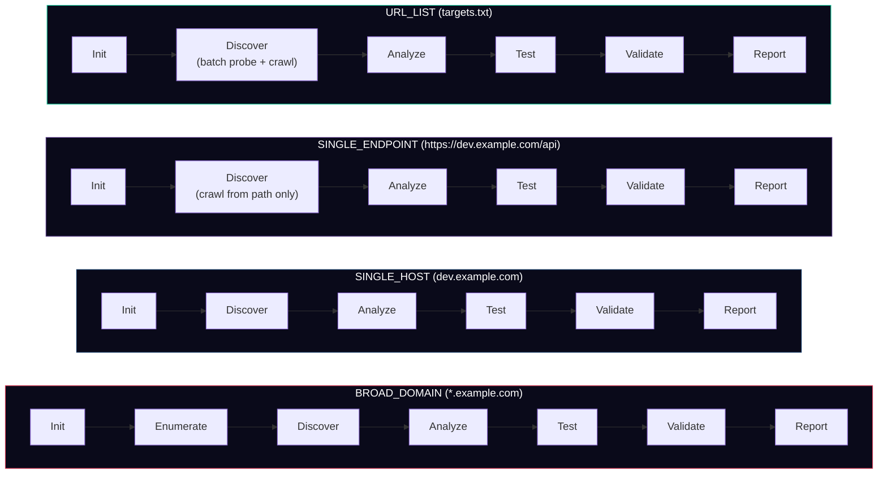
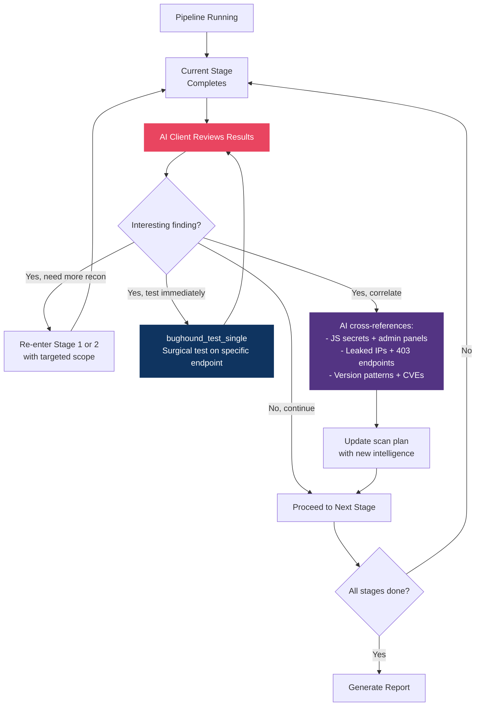
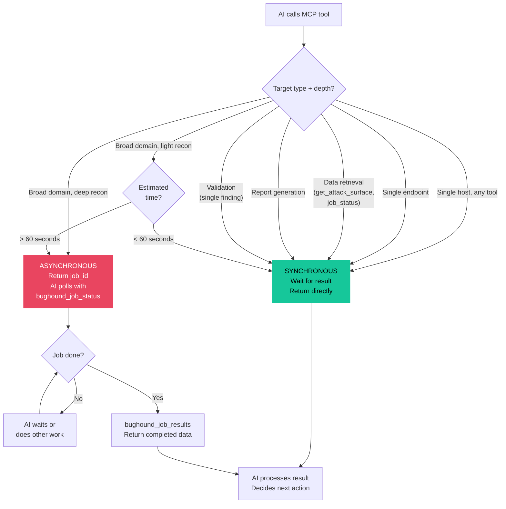

# BugHound Pipeline Flow

## Master Pipeline Flowchart

```mermaid
flowchart TD
    USER[/"User: 'Scan example.com'"/]
    
    USER --> S0

    subgraph S0["STAGE 0: INITIALIZE"]
        S0A[Classify Target] --> S0B{Target Type?}
        S0B -->|"*.example.com"| BROAD[BROAD_DOMAIN]
        S0B -->|"dev.example.com"| SINGLE[SINGLE_HOST]
        S0B -->|"https://dev.example.com/api"| ENDPOINT[SINGLE_ENDPOINT]
        S0B -->|"urls.txt"| URLLIST[URL_LIST]
        BROAD --> S0C[Create Workspace]
        SINGLE --> S0C
        ENDPOINT --> S0C
        URLLIST --> S0C
        S0C --> S0D[Set Depth: light/deep]
    end

    S0D --> ROUTE{Target Type?}
    
    ROUTE -->|BROAD_DOMAIN| S1
    ROUTE -->|SINGLE_HOST| S2
    ROUTE -->|SINGLE_ENDPOINT| S2_LITE
    ROUTE -->|URL_LIST| S2

    subgraph S1["STAGE 1: ENUMERATE"]
        S1A{Depth?}
        S1A -->|Light| S1B["Passive Only\nsubfinder + assetfinder +\nfindomain + crt.sh"]
        S1A -->|Deep| S1C["Passive + Bruteforce\n+ Permutations\n(async background job)"]
        S1B --> S1D[DNS Resolution]
        S1C --> S1D
        S1D --> S1E[Deduplicate + Pattern Analysis]
        S1E --> S1F["Output:\nsubdomains/all.txt\ndns/records.json"]
    end

    S1F --> S2

    subgraph S2["STAGE 2: DISCOVER"]
        S2A["2A: Probe + Fingerprint\nhttpx + wafw00f"]
        S2A --> S2_FILTER{"Filter:\nAlive? Parked?\nRedirect-only?"}
        S2_FILTER -->|Dead/Parked| S2_SKIP[Tag + Deprioritize]
        S2_FILTER -->|Alive| S2B
        S2B["2B: Crawl + URL Discovery\ngospider + gau + waybackurls"]
        S2B --> S2C["2C: JS Analysis\njsluice + secret extraction"]
        S2C --> S2D["2D: Parameter Harvest\nfrom URLs + arjun"]
        S2B --> S2E["2E: Directory Fuzzing\nffuf (parallel with 2C/2D)"]
        S2A --> S2F["2F: Cloud + Takeover\n(parallel with 2B-2E)"]
        S2D --> S2G["Output:\nhosts/ urls/ secrets/\nendpoints/ cloud/ dirfuzz/"]
        S2E --> S2G
        S2F --> S2G
        S2C --> S2G
    end

    subgraph S2_LITE["STAGE 2 (LITE): SINGLE ENDPOINT"]
        S2L1[Probe endpoint] --> S2L2[Crawl from path]
        S2L2 --> S2L3[JS analysis + param harvest]
        S2L3 --> S2L4[Output to workspace]
    end

    S2G --> S3
    S2L4 --> S3

    subgraph S3["STAGE 3: ANALYZE (AI DECISION ENGINE)"]
        S3A["bughound_get_attack_surface\nAggregate all Stage 2 data"]
        S3A --> S3B["Return to AI Client:\n- Stats + patterns\n- High-interest targets\n- Tech distribution\n- Anomalies + correlations"]
        S3B --> S3C["AI CLIENT REASONS:\n'GraphQL with no auth = priority 1'\n'WordPress 6.3 = check plugins'\n'Leaked API key in JS = verify'"]
        S3C --> S3D["AI submits scan plan\nbughound_submit_scan_plan"]
        S3D --> S3E{Valid Scope?}
        S3E -->|Yes| S3F[Store scan_plan.json]
        S3E -->|No| S3G[Reject + explain why]
        S3G --> S3C
    end

    S3F --> S4

    subgraph S4["STAGE 4: TEST"]
        S4A[Read scan_plan.json]
        S4A --> S4B["Map test_classes to\nnuclei template tags"]
        S4B --> S4C["Execute per target\nin priority order"]
        S4C --> S4D["nuclei + tech-specific checks"]
        S4D --> S4E["Output:\nvulnerabilities/scan_results.json"]
    end

    S4E --> S5

    subgraph S5["STAGE 5: VALIDATE"]
        S5A[Read scan_results.json]
        S5A --> S5B{For each finding}
        S5B --> S5C["SQLi? -> sqlmap"]
        S5B --> S5D["XSS? -> dalfox"]
        S5B --> S5E["SSRF? -> interactsh"]
        S5B --> S5F["Other? -> manual review"]
        S5C --> S5G{Confirmed?}
        S5D --> S5G
        S5E --> S5G
        S5G -->|Yes| S5H["Collect PoC evidence\nrequest/response/screenshot"]
        S5G -->|No| S5I[Tag: false_positive]
        S5F --> S5J[Tag: needs_manual_review]
        S5H --> S5K["Output:\nvulnerabilities/confirmed/\nvulnerabilities/validated.json"]
        S5I --> S5K
        S5J --> S5K
    end

    S5K --> S6

    subgraph S6["STAGE 6: REPORT"]
        S6A[Read all workspace data]
        S6A --> S6B["Bug Bounty Report\n(per-finding, submission-ready)"]
        S6A --> S6C["Technical Report\n(full assessment)"]
        S6A --> S6D["Executive Summary\n(high-level overview)"]
        S6B --> S6E["Output:\nreports/*.md"]
        S6C --> S6E
        S6D --> S6E
    end

    S6E --> DONE["Pipeline Complete"]

    %% FEEDBACK LOOP
    S5K -.->|"AI: 'Found SQLi on /api/users.\nLet me crawl deeper around /api/'"| S2
    S4E -.->|"AI: 'Interesting tech on host X.\nLet me enumerate more subdomains\nwith this pattern'"| S1

    style S0 fill:#1a1a2e,stroke:#e94560,color:#fff
    style S1 fill:#1a1a2e,stroke:#0f3460,color:#fff
    style S2 fill:#1a1a2e,stroke:#0f3460,color:#fff
    style S2_LITE fill:#1a1a2e,stroke:#0f3460,color:#fff
    style S3 fill:#1a1a2e,stroke:#e94560,color:#fff
    style S4 fill:#1a1a2e,stroke:#533483,color:#fff
    style S5 fill:#1a1a2e,stroke:#533483,color:#fff
    style S6 fill:#1a1a2e,stroke:#16c79a,color:#fff
    style DONE fill:#16c79a,stroke:#16c79a,color:#000
```



---

## Stage Collapse by Target Type



---

## AI Feedback Loop

This is BugHound's killer feature. The pipeline is linear, but the AI makes it iterative.



---

## Sync vs Async Decision Flow



---

## Data Flow Between Stages

```
STAGE 0                STAGE 1              STAGE 2              STAGE 3
┌──────────┐     ┌──────────────┐     ┌──────────────┐     ┌──────────────┐
│  config   │────>│ subdomains/  │────>│ hosts/       │────>│ Attack       │
│  .json    │     │  all.txt     │     │  live_hosts  │     │ Surface      │
│           │     │              │     │  technologies│     │ Summary      │
│ metadata  │     │ dns/         │     │  waf.json    │     │ (JSON)       │
│  .json    │     │  records.json│     │              │     │              │
│           │     │              │     │ urls/        │     │ + scan_plan  │
│           │     │              │     │  crawled     │     │   .json      │
│           │     │              │     │  parameters  │     │              │
│           │     │              │     │              │     │              │
│           │     │              │     │ secrets/     │     │              │
│           │     │              │     │  js_secrets  │     │              │
│           │     │              │     │              │     │              │
│           │     │              │     │ cloud/       │     │              │
│           │     │              │     │  takeover    │     │              │
└──────────┘     └──────────────┘     └──────────────┘     └──────────────┘
                                                                  │
                                                                  ▼
STAGE 6                STAGE 5              STAGE 4         scan_plan.json
┌──────────────┐  ┌──────────────┐     ┌──────────────┐     ┌──────────┐
│ reports/     │<─│ vulns/       │<────│ vulns/       │<────│ Targets  │
│  bug_bounty  │  │  validated   │     │  scan_results│     │ Tools    │
│  technical   │  │  confirmed/  │     │              │     │ Priority │
│  executive   │  │  false_pos   │     │              │     │ Endpoints│
└──────────────┘  └──────────────┘     └──────────────┘     └──────────┘
```

Each stage reads from the previous stage's output files in the workspace. Stages never communicate directly. The workspace filesystem IS the communication layer.
