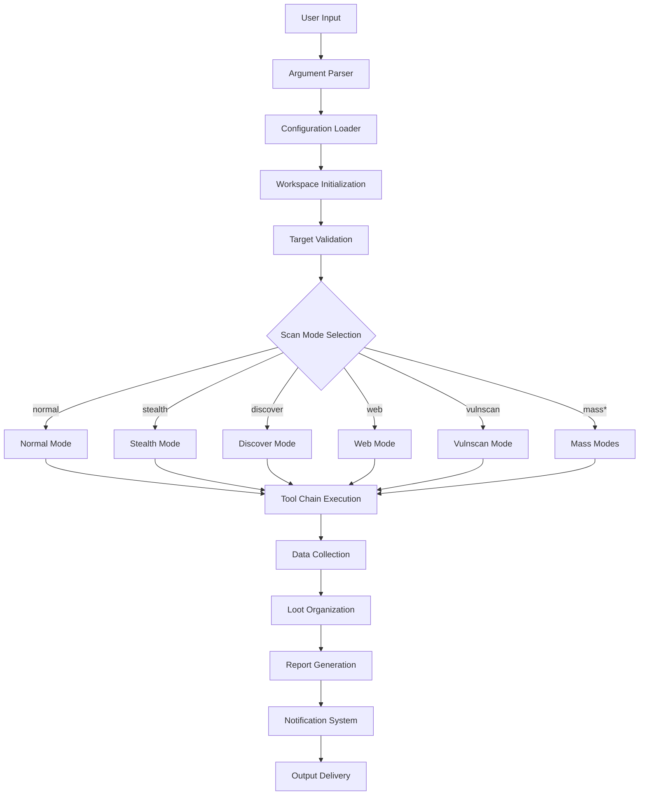

# Sn1per Tool Architecture and Data Flow Analysis

## Overview

Sn1per is a comprehensive automated penetration testing framework designed for external attack surface management and vulnerability assessment. It follows a modular architecture with multiple scan modes and extensive tool integration.

## Architecture Components

### 1. Core Structure

```
/usr/bin/sniper (Main executable)
├── /usr/share/sniper/
│   ├── sniper.conf (Configuration)
│   ├── modes/ (Scan mode implementations)
│   │   ├── normal.sh
│   │   ├── stealth.sh
│   │   ├── discover.sh
│   │   ├── web.sh
│   │   ├── vulnscan.sh
│   │   ├── massweb.sh
│   │   ├── masswebscan.sh
│   │   ├── massvulnscan.sh
│   │   ├── massportscan.sh
│   │   ├── massdiscover.sh
│   │   ├── airstrike.sh
│   │   └── nuke.sh
│   ├── bin/ (Utility scripts)
│   │   ├── update-plugins.sh
│   │   ├── webscreenshot.py
│   │   ├── zap-scan.py
│   │   ├── goohak.sh
│   │   ├── nessus.sh
│   │   └── slack.sh
│   └── plugins/ (External tool integrations)
└── /sniper/loot/ (Output directory)
    └── workspace/
        ├── domains/
        ├── ips/
        ├── nmap/
        ├── web/
        ├── vulnerabilities/
        ├── screenshots/
        ├── osint/
        ├── scans/
        └── reports/
```

### 2. Scan Modes

#### Primary Modes:
- **Normal Mode**: Standard comprehensive scan
- **Stealth Mode**: Low-profile scanning with evasion techniques
- **Discover Mode**: Network discovery and enumeration
- **Web Mode**: Web application focused scanning (ports 80/443)
- **Vulnscan Mode**: Vulnerability-focused scanning
- **Port Mode**: Specific port scanning

#### Mass Scanning Modes:
- **Massweb**: Bulk web application scanning
- **Masswebscan**: Mass web vulnerability scanning
- **Massvulnscan**: Mass vulnerability assessment
- **Massportscan**: Mass port scanning
- **Massdiscover**: Mass network discovery

#### Advanced Modes:
- **Airstrike Mode**: Aggressive scanning
- **Nuke Mode**: Comprehensive scan with all features enabled

### 3. Configuration System

#### Main Configuration (`sniper.conf`):
```bash
# Core Settings
INSTALL_DIR="/usr/share/sniper"
SNIPER_PRO=$INSTALL_DIR/pro.sh
PLUGINS_DIR="$INSTALL_DIR/plugins"

# Scan Options
AUTO_BRUTE="0"
FULLNMAPSCAN="0"
OSINT="0"
RECON="0"
VULNSCAN="0"

# Output Settings
REPORT="1"
LOOT="1"
BROWSER="firefox"
USER_AGENT="Mozilla/5.0..."

# Notification Settings
SLACK_NOTIFICATIONS="0"
```

## Data Flow Architecture

### 1. Initialization Phase
```
User Input → Argument Parsing → Configuration Loading → Workspace Setup
```

### 2. Scan Execution Flow
```
Target Validation → Mode Selection → Tool Chain Execution → Data Collection → Report Generation
```

### 3. Detailed Data Flow



### 4. Tool Integration Pattern

Each scan mode follows this pattern:
1. **Pre-scan Setup**: Environment preparation, target validation
2. **Tool Execution**: Sequential or parallel tool execution
3. **Data Processing**: Parse and normalize tool outputs
4. **Storage**: Organize results in workspace structure
5. **Post-processing**: Generate reports and notifications

### 5. Workspace Data Structure

```
/sniper/loot/workspace/<WORKSPACE_NAME>/
├── domains/
│   ├── targets-all-sorted.txt
│   ├── domains_new-*.txt
│   └── subdomains.txt
├── ips/
│   ├── ips-all-sorted.txt
│   └── live-ips.txt
├── nmap/
│   ├── nmap-*.xml
│   └── nmap-*.txt
├── web/
│   ├── dirsearch-*.txt
│   ├── spider-*.txt
│   └── whatweb-*.txt
├── vulnerabilities/
│   ├── sc0pe-all-vulnerabilities-sorted.txt
│   ├── critical_vulns_total.txt
│   ├── high_vulns_total.txt
│   ├── medium_vulns_total.txt
│   └── low_vulns_total.txt
├── screenshots/
├── osint/
├── scans/
│   ├── tasks.txt
│   ├── notifications.txt
│   └── scheduled/
└── reports/
    ├── sniper-report.html
    └── sniper_summary-*.html
```

## Key Features for MCP Integration

### 1. Modular Design Benefits
- **Separation of Concerns**: Each scan mode is isolated
- **Tool Abstraction**: Individual tools can be wrapped as MCP functions
- **Configuration Management**: Centralized configuration system
- **Output Standardization**: Consistent data formats

### 2. Workflow Patterns to Adopt

#### Sequential Tool Execution:
```bash
# Pattern from Sn1per modes
source bin/tool1.sh
source bin/tool2.sh
source bin/tool3.sh
```

#### Data Aggregation:
```bash
# Combine results from multiple tools
cat tool1_output.txt tool2_output.txt > combined_results.txt
sort -u combined_results.txt > final_results.txt
```

#### Risk Scoring:
```bash
# Calculate risk scores
WORKSPACE_RISK_TOTAL=$(($CRITICAL*4+$HIGH*3+$MEDIUM*2+$LOW*1))
```

### 3. Improvements for Our MCP

#### 1. **Enhanced Workflow Management**
- Implement scan mode templates similar to Sn1per's modes/
- Add sequential and parallel execution capabilities
- Create workflow orchestration system

#### 2. **Better Data Organization**
- Adopt Sn1per's workspace structure
- Implement consistent output formats
- Add data aggregation and deduplication

#### 3. **Risk Assessment Integration**
- Add vulnerability scoring system
- Implement risk calculation algorithms
- Create prioritized output reports

#### 4. **Configuration Management**
- Centralized configuration system
- Mode-specific settings
- User preference management

#### 5. **Reporting and Visualization**
- HTML report generation
- Risk dashboards
- Progress tracking

#### 6. **Tool Chain Management**
- Tool availability checking
- Graceful degradation when tools are missing
- Alternative tool suggestions

## Recommended MCP Enhancements

### 1. **Workflow Engine**
```python
class ScanWorkflow:
    def __init__(self, mode: str, target: str):
        self.mode = mode
        self.target = target
        self.tools = self.load_mode_config(mode)
    
    def execute(self):
        for tool in self.tools:
            result = self.run_tool(tool)
            self.store_result(result)
        return self.generate_report()
```

### 2. **Enhanced Tool Integration**
```python
class ToolManager:
    def __init__(self):
        self.available_tools = self.check_tool_availability()
    
    def run_with_fallback(self, primary_tool: str, fallback_tools: list):
        if primary_tool in self.available_tools:
            return self.run_tool(primary_tool)
        for fallback in fallback_tools:
            if fallback in self.available_tools:
                return self.run_tool(fallback)
        raise ToolNotAvailableError()
```

### 3. **Risk Assessment System**
```python
class RiskCalculator:
    SEVERITY_WEIGHTS = {
        'critical': 4,
        'high': 3,
        'medium': 2,
        'low': 1,
        'info': 0
    }
    
    def calculate_risk_score(self, vulnerabilities: list) -> int:
        return sum(self.SEVERITY_WEIGHTS.get(vuln.severity, 0) 
                  for vuln in vulnerabilities)
```

## Conclusion

Sn1per's architecture demonstrates excellent practices for building scalable penetration testing frameworks. The modular design, comprehensive tool integration, and structured data management provide a solid foundation for enhancing our MCP server with similar capabilities.

Key takeaways for our MCP improvement:
1. Implement modular scan modes
2. Add comprehensive workspace management
3. Integrate risk assessment capabilities
4. Enhance reporting and visualization
5. Improve tool chain management with fallback mechanisms